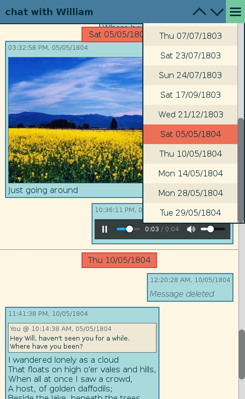

# wasaver
Save WhatsApp chats and browse them offline

<p align="center"></p>

wasaver uses [WebWhatsapp-Wrapper](https://github.com/mukulhase/WebWhatsapp-Wrapper) to get WhatsApp chats from WhatsApp Web interface. Messages data is stored in a MySQL database and media is downloaded into a local directory.  
Later a PHP script can be used offline to fetch the data from the database. An HTML page is generated, with which the chat can be viewed through a WhatsApp-like interface.

## Prerequisites
You need WebWhatsapp-Wrapper dependences and a MySQL database up and running (tested with MariaDB).

## Install
First clone wasaver repository:
```
$ git clone https://github.com/cressidacressida/wasaver.git
```
Then clone WebWhatsapp-Wrapper and patch it to get some message properties available in `Message` objects:
```
$ cd wasaver
$ git clone https://github.com/mukulhase/WebWhatsapp-Wrapper.git
$ patch -p1 < WebWhatsapp-Wrapper.patch
```
Fill `wasaver.conf` with your MySQL host and credentials and you're ready to go.

## Usage
### Chat download
The chat to be downloaded can be specified either by command line argument or by the `contact_name` variable in the config file. Filling the `username` setting with your WhatsApp username is also recommended. If you have a Firefox profile already logged-in in WhatsApp Web you should also put it in, in order to avoid repeating the QR code verification.   
Description of commmand line arguments is available via:
```
$ ./wasaver.py -h
```

A database named `chat_[safe_contact_name]` is created and populated (`safe_contact_name` is nothing but `contact_name` with all non-alphanumeric characters removed). Media is downloaded in `media_[safe_contact_name]`.   
Running the same command again will just update the database with new messages and related media, unless option `-R` is used.

### Chat browsing
`page.php` uses the `contact_name` variable defined inside itself (if not commented) or the setting in the config file to get the desired data from the database:
```
$ php page.php > page.html
```
## Notes
Tested with WebWhatsapp-Wrapper latest version as to 18/11/2020. HTML page tested with Firefox only.

## Legal
This code is in no way affiliated with, authorized, maintained, sponsored or endorsed by WhatsApp or any of its affiliates or subsidiaries. This is an independent and unofficial software. Use at your own risk.

